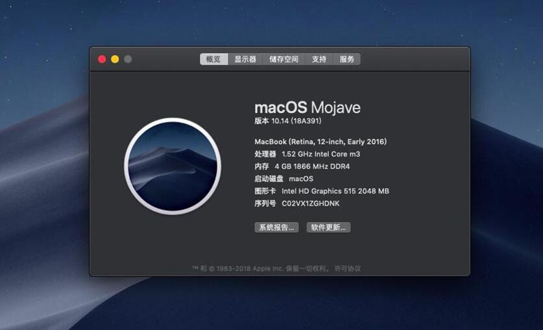
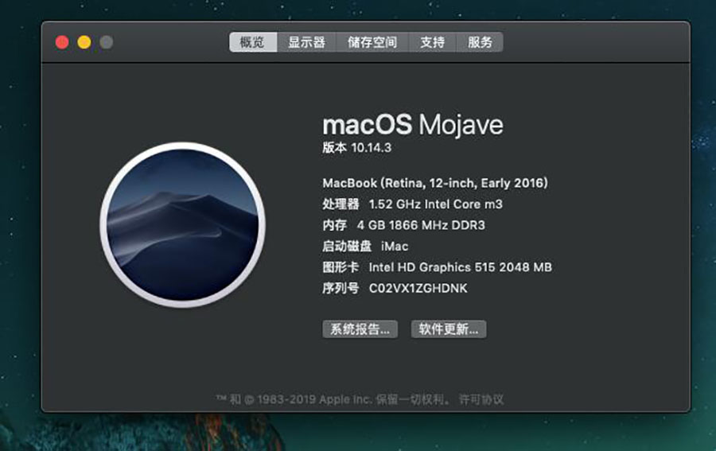
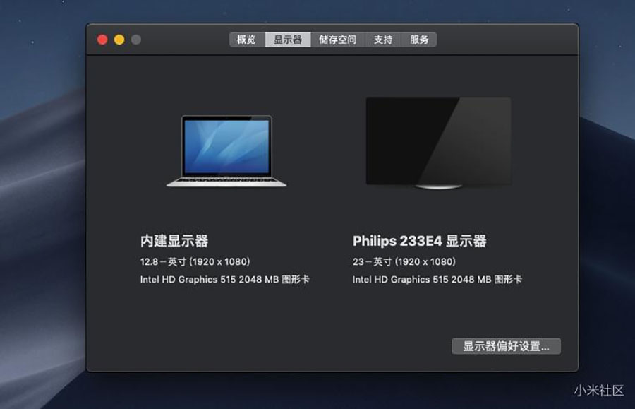
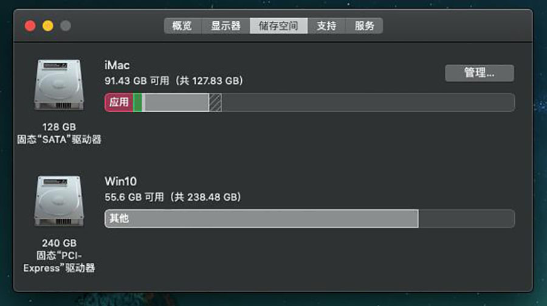
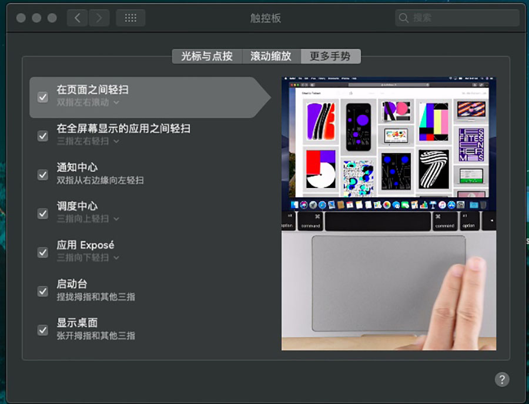
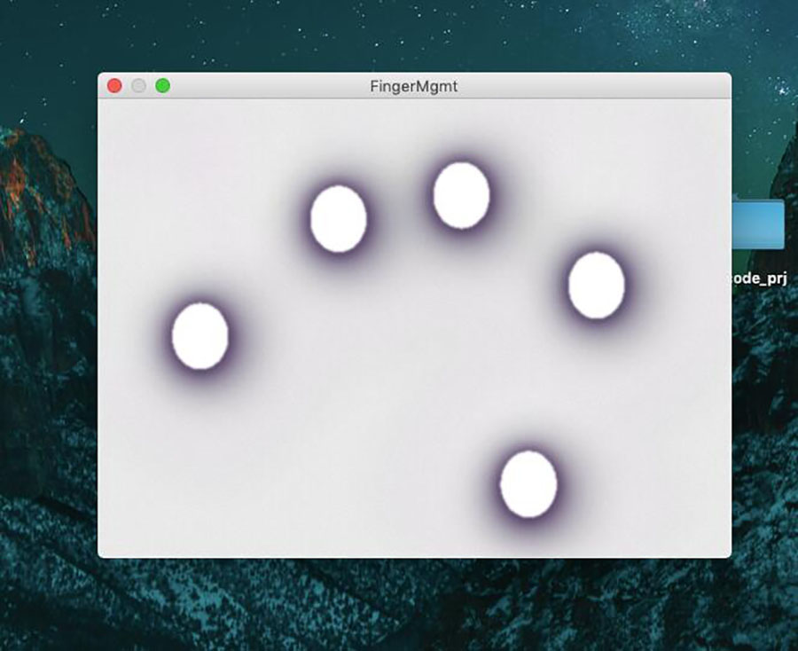
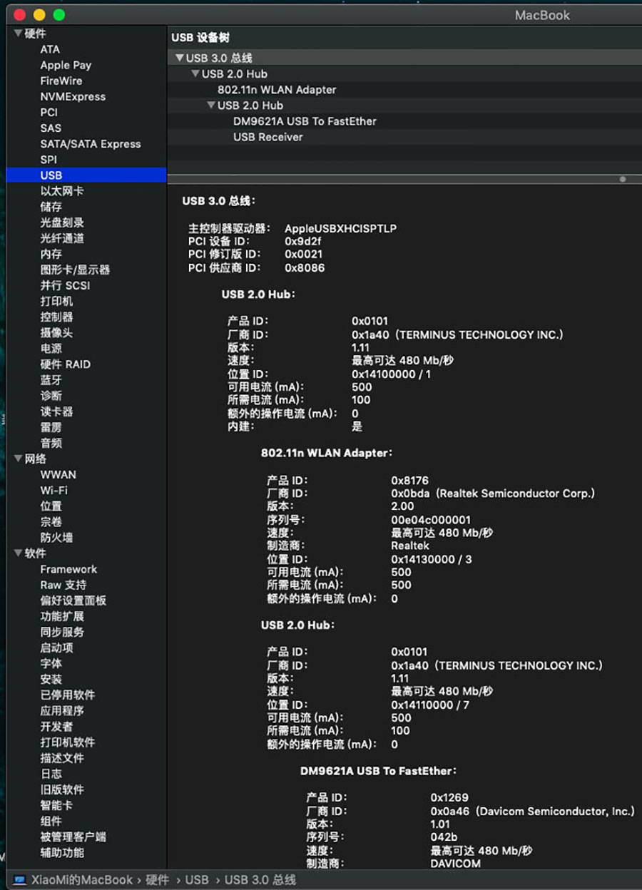
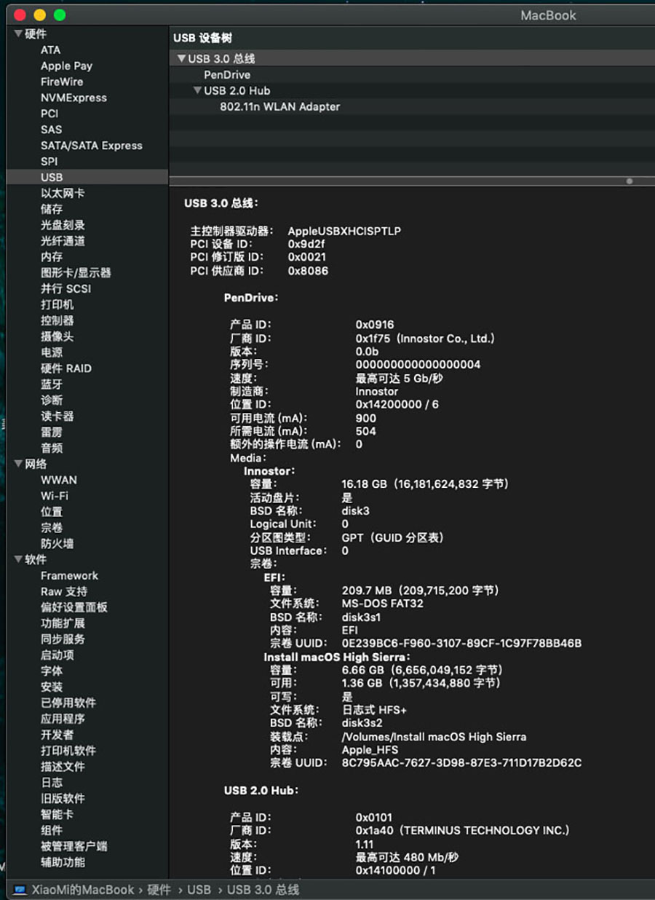

# Xiaomi-Air12.5-1stGeneration
Hackintosh Xiaomi Air 12.5(1stGen) EFI Clover
黑苹果小米笔记本12.5寸(第一代) EFI Clover

## 配置
| 规格     | 详细信息                             |
| :------- | :----------------------------------- |
| 电脑型号 | Xiaomi Air 12.5 1st Generation       |
| 操作系统 | macOS Mojave 10.14                   |
| 处理器   | Intel Core m3-6Y30 @ 0.90GHz ~ 2GHz  |
| 内存     | 4 GB  1867MHz(2G x 2)                |
| 硬盘     | SAMSUNG MZNTY128HDHP-00000(128G SSD) |
| 显卡     | 英特尔 HD Graphics 515               |
| 显示器   | FHD 1920x1080 (12.5 英寸)            |
| 声卡     | ALC235 (layout-id:28)                |
| 网卡     | Intel 8260 (外挂USB WIFI)            |

## 完成度
- 核显，Hackintool修复，驱动/水波纹正常（部分软件调整窗口大小时掉帧）；
- USB，定制USBPorts.kext，关闭多余的USB，只保留USB3口以及他的2.0；
- 蓝牙&WIFI，intel 8260无解，已屏蔽，wifi用外置USB替代；
- 触摸板，多指操作正常，使用VoodooI2C+VoodooI2CSynaptics驱动，SYNA3105；
- 声卡，ALC235注入ID=28，CodecCommander + ALCPlugFix睡眠修复(hda-verb 0x19 SET_PIN_WIDGET_CONTROL 0x25/hda-verb 0x21 SET_UNSOLICITED_ENABLE 0x83)；
- 音量/亮度，F1~F3音量调节，F4/F5亮度调节；
- FakeSMC，电池信息正常，电源/电池切换刷新正常；
- 禁用休眠，只开启睡眠，鼠标唤醒；

## 截图

## 感谢：
- [RehabMan](https://github.com/RehabMan)
- [vit9696](https://github.com/vit9696)
- [alexandred](https://github.com/alexandred)
- [daliansky](https://blog.daliansky.net)
- [goodwin](https://github.com/goodwin)
- [penghubingzhou](https://www.penghubingzhou.cn)

